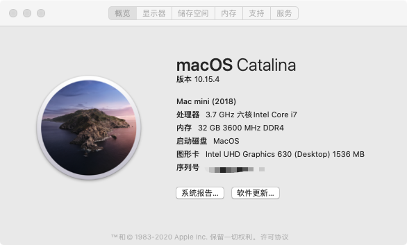

# Opencore(0.5.7) configuration on Ausu Z370a

### Hardware

- Ausu Z370a
- Intel Core 8700K
- 4 * Kingston Predator 3600MHz 8G
- 1 * Samsung 970 EVO NVMe M.2 250GB
- 1 * Broadcom BCM943602CDP

#### Working

- CPU Turbo Boost
- Memory XMP
- Ethernet
- Onboard Audio Output
- Sleep/Wake
- All USB ports Patched
- iMessage
- App Store
- Facetime
- Bluetooth
- Wi-Fi
- Airdrop

#### ⚠️Attention

- Please generate your own PlatformInfo(Generic + platformNVRAM)
- If you are using discrete graphics card, please remove '-wegnoegpu'